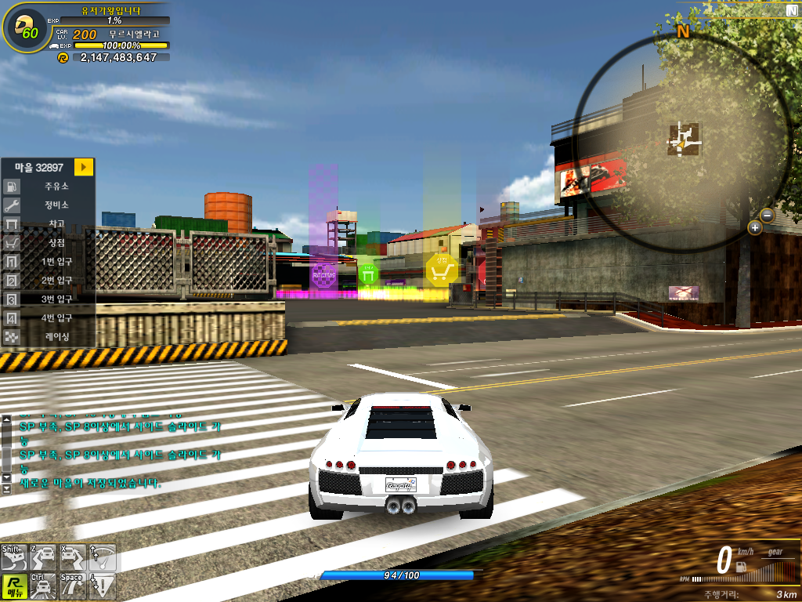

  <b>한국어</b>
  |
  <a href="https://github.com/NatsuFlatWhite/Raycipy-Emulator/blob/main/Eng.md">English</a>

# Raycipy-Emulator

레이시티 v1.325 (2007년 2월 8일 릴리즈) 클라이언트를 구동하기 위한 Python 기반 서버 에뮬레이터입니다. 
완성된 게임 서버가 아니며, 일부 패킷을 구현하여 **상업적 목적이 아닌 필드 구경과 추억 재현**을 목적으로 합니다. 
아직 버그가 다수 존재하며, 작동하지 않는 시스템이 많습니다.

## 소개

  
   
  개편 전 도곡동 마을

v1.325는 게임 서비스 약 2달이 지난 시점의 클라이언트입니다.  
현재와는 다른 시스템이 많으며, 사양 최적화 패치(필드 텍스처 저화질, 디테일 감소)가 적용되기 전 마지막 버전입니다.

이때의 레이시티를 추억하거나 체험해 보기 위해 제작한 에뮬레이터입니다.

## 실행 방법

[클라이언트 다운로드](https://drive.google.com/file/d/1ZnlqomkJ58C7djYhDAkFgFsNB7RA_zRK/view?usp=sharing)

`main.py`를 통해 서버를 실행하고, `Raycity.exe`로 게임에 접속하면 됩니다.  

로그인 스테이지에서 사용하고 싶은 ID를 입력하고 서버에 접속하면 계정이 자동 생성됩니다.  
생성된 계정은 `Raycity_db.json`에 저장됩니다.

## 기능
- HTTP
  - `serverlist.xml`을 전달합니다.
- Login
  - 로그인 처리
  - 캐릭터 생성/삭제/선택
  - 차량 목록/차량 정보 조회
  - 인벤토리 조회
  - 상점 아이템 구매 처리
  - 인벤토리 아이템 이동/장착 처리 일부
- Game
  - Agent 처리
  - 필드 입장/이동 처리 일부
  - 인벤토리/상점/아이템 처리 일부
  - TimeSync / KeepAlive
  - 계정 상태 갱신
- UDP
  - UDP Echo
  - 필드 입장 관련 응답
  - TimeSync 일부
- DB
  - 기본 저장 위치: `data/Raycity_db.json`
  - 캐릭터, 차량, 인벤토리, 아이템 등 저장
